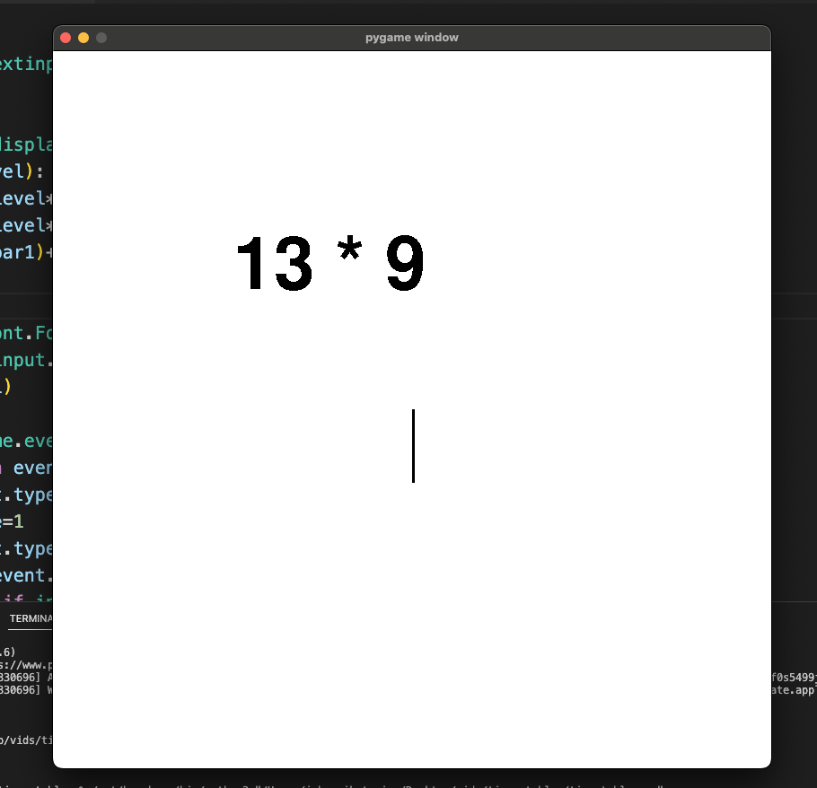

# Times Tables
This repository is a times tables game using pygame, pygame_textinput(https://github.com/Nearoo/pygame-text-input) and the inbuilt <code>random</code> module. It adapts based on how good the person is playing.
</img>
